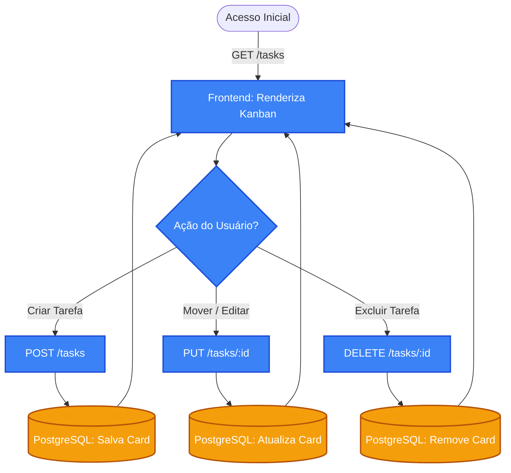

# 📋 Desafio Fullstack – Kanban de Tarefas (React + Go + PostgreSQL)

Aplicação desenvolvida para o processo seletivo (Desafio Técnico) da **Veritas Consultoria Empresarial**. Trata-se de um Kanban de tarefas funcional e responsivo, dividido entre um frontend moderno e um backend robusto em Go (Golang) com persistência em banco de dados relacional.

---

## 🛠️ Tecnologias Utilizadas

### 💻 Frontend

* **React** (Interface do Usuário)
* **CSS / Tailwind** (Estilização responsiva e moderna)
* **HTML5 Drag and Drop API** (Para movimentação dos cards)

### ⚙️ Backend & Infraestrutura

* **Go (Golang)** (Linguagem principal da API RESTful)
* **Gin Gonic** (Framework web rápido para manipulação de rotas e CORS)
* **GORM** (ORM para mapeamento objeto-relacional)
* **Godotenv** (Gerenciamento seguro de variáveis de ambiente)
* **PostgreSQL** (Banco de dados relacional principal)
* **Docker & Docker Compose** (Orquestração do ambiente de banco de dados)

---

## 📂 Estrutura do Repositório

```text
/
├── backend/
│   ├── config/           # Configuração de conexão com o banco de dados
│   ├── controllers/      # Handlers das rotas e lógica de negócio (CRUD)
│   ├── models/           # Definição das Structs (ex: Task) para o GORM
│   ├── main.go           # Inicialização do servidor, rotas e middlewares
│   ├── docker-compose.yml# Orquestração do contêiner PostgreSQL
│   └── .env              # Variáveis de ambiente locais (ignorado pelo git)
├── frontend/
│   ├── public/           # Arquivos estáticos
│   ├── src/
│   │   ├── components/   # Componentes reutilizáveis da interface
│   │   └── App.tsx       # Componente principal e chamadas à API
│   ├── package.json      # Dependências do projeto Node
│   └── ... 
└── README.md             # Documentação do projeto

```

---

## 🚀 Como Executar o Projeto

Certifique-se de ter o **Go**, **Node.js**, **Docker** e **Docker Compose** instalados em sua máquina.

### 1️⃣ Clonando o Repositório

```bash
git clone https://github.com/joaosemx/desafio-fullstack-veritas

```

### 2️⃣ Iniciando o Banco de Dados (Docker Compose)

É estritamente necessário subir o contêiner do PostgreSQL antes de iniciar a API. Navegue até a pasta `backend/` e execute:

```bash
cd backend
docker compose up -d

```

### 3️⃣ Executando o Backend (Go)

Ainda no diretório `backend/`, crie o arquivo `.env` para garantir a resolução correta de rede:

```env
DB_HOST=127.0.0.1
DB_PORT=5433
DB_USER=postgres
DB_PASSWORD=sua_senha_aqui
DB_NAME=kanbandb

```

Em seguida, inicie o servidor:

```bash
go run main.go

```

*O servidor será iniciado e ficará acessível em `http://localhost:8080`.*

### 4️⃣ Executando o Frontend (Node)

Abra um segundo terminal na raiz do projeto, navegue até a pasta `frontend/` e execute os comandos:

```bash
cd frontend

# Instalar as dependências
npm install

# Iniciar a aplicação em modo de desenvolvimento
npm run dev

```

*A aplicação abrirá no navegador na porta definida pelo framework (geralmente `http://localhost:3000` ou `http://localhost:5173`).*

---

## 🧠 Decisões Técnicas

1. **Persistência Relacional Integrada:** Optou-se por PostgreSQL rodando via Docker para garantir integridade dos dados e simular um ambiente de produção real, substituindo o armazenamento em memória ou arquivos JSON.
2. **Migrations Automáticas:** Uso do recurso de AutoMigrate do GORM. Isso garante que a estrutura de tabelas do banco de dados seja criada e atualizada de forma automatizada ao iniciar o servidor, reduzindo o atrito de setup.
3. **Segurança de Credenciais:** As configurações de banco e portas foram isoladas em variáveis de ambiente (`.env`) processadas pelo pacote `godotenv`, evitando o vazamento de senhas no repositório.
4. **CORS Configurado:** Implementação de middleware nativo no framework Gin para permitir a comunicação assíncrona fluida entre o cliente web (frontend) e a API, eliminando bloqueios de segurança cruzada no navegador.

---

## 🚧 Limitações Conhecidas & Melhorias Futuras

* **Limitação:** Autenticação e gestão de usuários não estão implementadas no escopo atual.
* **Melhorias Futuras:**
* ➕ Adicionar "mini tarefas" dentro dos cards para melhor distribuição da atividade.
* 👥 Adicionar a opção de ter múltiplos usuários para atribuição de tarefas.
* ⏱️ Adicionar *cycle time* e registro de quantidade de horas gastas na tarefa.
* 📅 Adicionar a opção de visualização da data de criação da tarefa.
* 🏷️ Implementar labels de prioridade da tarefa.


---

## 🗺️ Documentação

O fluxo de dados da aplicação, detalhando a jornada do usuário e a comunicação entre o frontend, a API RESTful e o banco de dados, ocorre sob a seguinte arquitetura:

